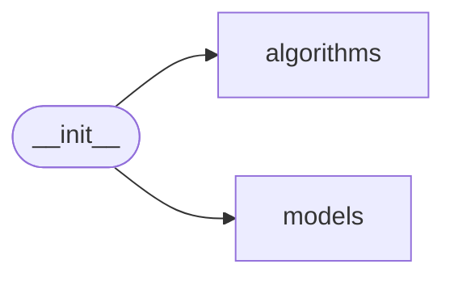

# Code Overview

[_Documentation generated by Documatic_](https://www.documatic.com)

<!---Documatic-section-Codebase Structure Python-start--->
## Codebase Structure Python

The codebase has a single-depth folder structure,
                with 5 code files in total.

<!---Documatic-block-system_architecture-start--->

<!---Documatic-block-system_architecture-end--->

# #
<!---Documatic-section-Codebase Structure Python-end--->

<!---Documatic-section-Key Objects-start--->
## Key Objects

There are exposed imports at level-0
from the source directory (evostra)

<!---Documatic-block-evostra-start--->

	
<code>evostra</code> (Click to Expand!)

* `evostra.algorithms.evolution_strategy.EvolutionStrategy`
* `evostra.models.feed_forward_network.FeedForwardNetwork`

<!---Documatic-block-evostra-end--->

# #
<!---Documatic-section-Key Objects-end--->

<!---Documatic-section-Important Functions-start--->
## Important Functions

<!---Documatic-block-important_funcs-start--->
<!---Documatic-block-end_user_funcs-start--->
### End User Exposed Functions

* evostra.models.feed_forward_network.FeedForwardNetwork
* evostra.algorithms.evolution_strategy.EvolutionStrategy
<!---Documatic-block-end_user_funcs-end--->
<!---Documatic-block-important_funcs-end--->

# #
<!---Documatic-section-Important Functions-end--->

<!---Documatic-section-File IO-start--->
## File IO

<!---Documatic-block-file_io-start--->
The following files have file read operations

<!---Documatic-block-evostra.models-start--->

	
<code>evostra.models</code> (Click to Expand!)

* evostra.models.feed_forward_network

<!---Documatic-block-evostra.models-end--->

The following files have file write operations

<!---Documatic-block-evostra.models-start--->

	
<code>evostra.models</code> (Click to Expand!)

* evostra.models.feed_forward_network

<!---Documatic-block-evostra.models-end--->
<!---Documatic-block-file_io-end--->

# #
<!---Documatic-section-File IO-end--->

<!---Documatic-section-Class Hierarchy-start--->
## Class Hierarchy

<!---Documatic-block-object-start--->

	
<code>object</code> (Click to Expand!)

* evostra.algorithms.evolution_strategy.EvolutionStrategy
* evostra.models.feed_forward_network.FeedForwardNetwork

<!---Documatic-block-object-end--->

# #
<!---Documatic-section-Class Hierarchy-end--->

[_Documentation generated by Documatic_](https://www.documatic.com)